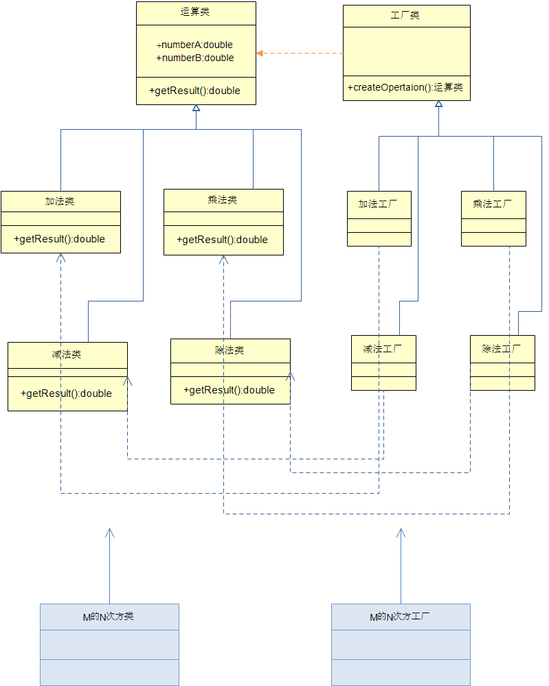

### 工厂模式

#### 定义
提供了一种创建对象的最佳方式。     

#### 意图          
定义一个创建对象的接口，让其子类自己决定实例化哪一个工厂类，工厂模式使其创建过程延迟到子类进行。

#### 主要解决   
主要解决接口选择的问题。

####  何时使用      
明确地计划不同条件下创建不同实例时。

#### 如何解决       
让其子类实现工厂接口，返回的也是一个抽象的产品。

#### 应用实例       
1、您需要一辆汽车，可以直接从工厂里面提货，而不用去管这辆汽车是怎么做出来的，以及这个汽车里面的具体实现。       
2、Hibernate 换数据库只需换方言和驱动就可以。        
3、JDK 中的工厂设计模式实例。       
 - java.util.Calendar, NumberFormat getInstance() 使用了工厂方法模式；     

#### 优点         
1、一个调用者想创建一个对象，只要知道其名称就可以了。        
2、扩展性高，如果想增加一个产品，只要扩展一个工厂类就可以。 3、屏蔽产品的具体实现，调用者只关心产品的接口。     

#### 缺点     
每次增加一个产品时，都需要增加一个具体类和对象实现工厂，使得系统中类的个数成倍增加，在一定程度上增加了系统的复杂度，同时也增加了系统具体类的依赖。

#### 使用场景           
1、数据库访问，当用户不知道最后系统采用哪一类数据库，以及数据库可能有变化时。         
2、设计一个连接服务器的框架，需要三个协议，"POP3"、"IMAP"、"HTTP"，可以把这三个作为产品类，共同实现一个接口。        

#### 注意事项       
作为一种创建类模式，复杂对象适合使用工厂模式，而简单对象，特别是只需要通过 new 就可以完成创建的对象，无需使用工厂模式。

#### 实现     
创建一个 Shape 接口和实现 Shape 接口的实体类。下一步是定义工厂类 ShapeFactory。
FactoryPatternDemo演示类使用 ShapeFactory 来获取 Shape 对象。它将向 ShapeFactory 传递信息（CIRCLE / RECTANGLE / SQUARE），以便获取它所需对象的类型。  
    
