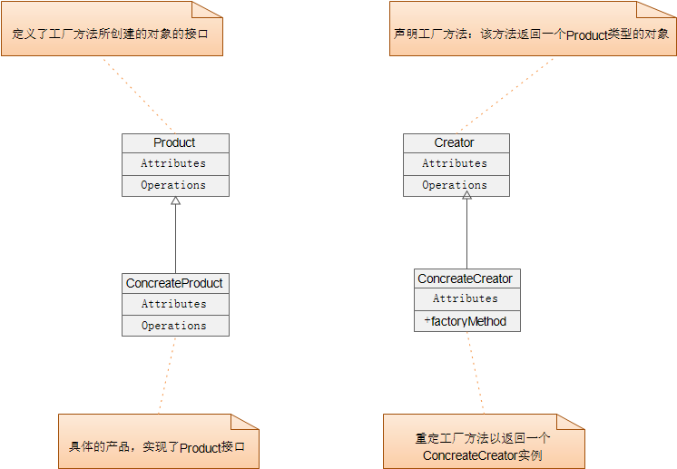

### 工厂模式
* 结构图           

* code example     
[工厂模式](../src/main/java/com/lvt/pattern_01)

* 意图                
定义一个创建对象的接口，让其子类自己决定实例化哪一个工厂类，工厂模式使其创建过程延迟到子类进行。

* 主要解决          
主要解决接口选择的问题。

* 何时使用             
明确地计划不同条件下创建不同实例时。

* 如何解决              
让其子类实现工厂接口，返回的也是一个抽象的产品。

* 应用实例              
1、Hibernate 换数据库只需换方言和驱动就可以。        
2、JDK 中的工厂设计模式实例，java.util.Calendar getInstance() 使用了工厂方法模式。      

* 优点                
1、扩展性高，如果想增加一个产品，只要扩展一个工厂类就可以。 
2、屏蔽产品的具体实现，调用者只关心产品的接口。     

* 缺点            
每次增加一个产品时，都需要增加一个具体类和对象实现工厂，在一定程度上增加了系统的复杂度。

* 使用场景                  
1、数据库访问，当用户不知道最后系统采用哪一类数据库，以及数据库可能有变化时。         
2、设计一个连接服务器的框架，需要三个协议，"POP3"、"IMAP"、"HTTP"，可以把这三个作为产品类，共同实现一个接口。        

* 注意事项              
作为一种创建类模式，复杂对象适合使用工厂模式，而简单对象，特别是只需要通过 new 就可以完成创建的对象，无需使用工厂模式。