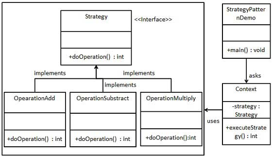

### 策略模式   

#### 定义
一个类的行为或其算法可以在运行时更改。    

#### 意图          
定义一系列的算法,把它们一个个封装起来, 并且使它们可相互替换。

#### 主要解决   
在有多种算法相似的情况下，使用 if...else 所带来的复杂和难以维护。      

####  何时使用      
一个系统有许多许多类，而区分它们的只是他们直接的行为。          

#### 如何解决       
将这些算法封装成一个一个的类，任意地替换。

#### 关键代码
实现同一个接口。        

#### 应用实例      
1、JAVA AWT 中的 LayoutManager。  
2、诸葛亮的锦囊妙计，每一个锦囊就是一个策略。             

#### 优点         
1、算法可以自由切换。      
2、避免使用多重条件判断。      
3、扩展性良好。        

#### 缺点     
策略类会增多。所有策略类都需要对外暴露。             

#### 使用场景      
1、如果在一个系统里面有许多类，它们之间的区别仅在于它们的行为，那么使用策略模式可以动态地让一个对象在许多行为中选择一种行为。       
2、一个系统需要动态地在几种算法中选择一种。

#### 注意事项       
如果一个系统的策略多于四个，就需要考虑使用混合模式，解决策略类膨胀的问题。       

#### 实现     
我们将创建一个定义活动的 Strategy 接口和实现了 Strategy 接口的实体策略类。Context 是一个使用了某种策略的类。
StrategyPatternDemo，我们的演示类使用 Context 和策略对象来演示 Context 在它所配置或使用的策略改变时的行为变化。      

#### 示例Java代码
[策略模式](../src/main/java/com/lvt/pattern_23)